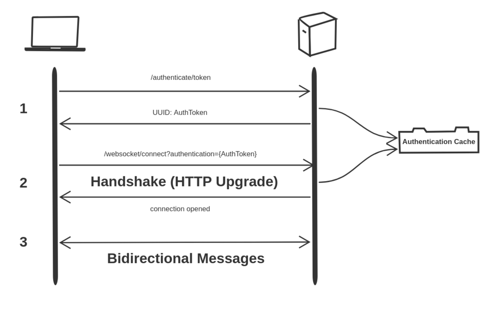
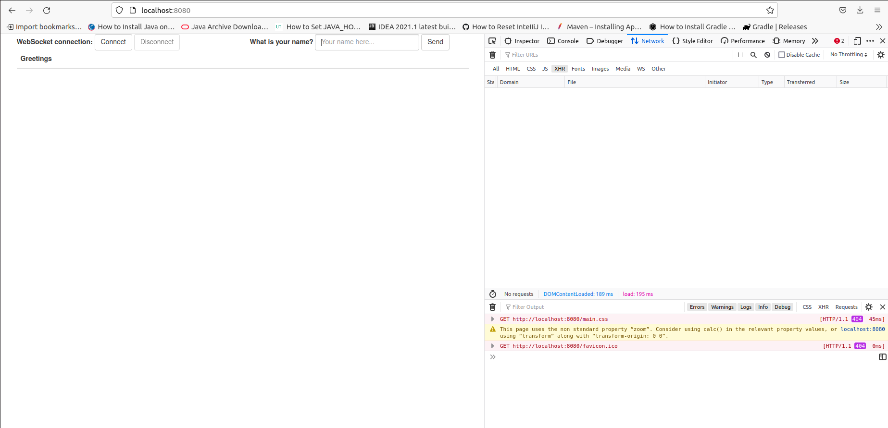
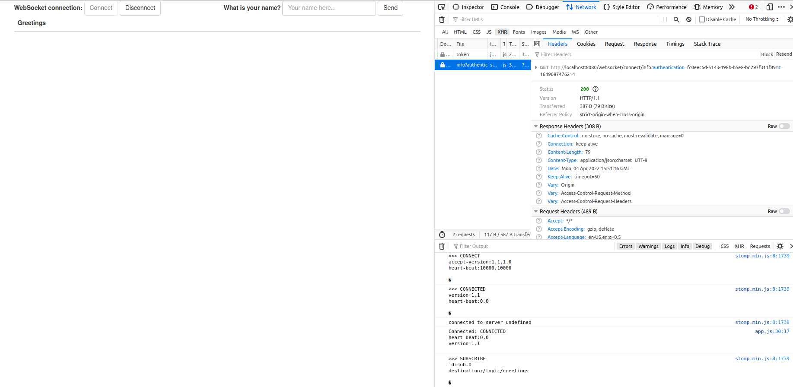
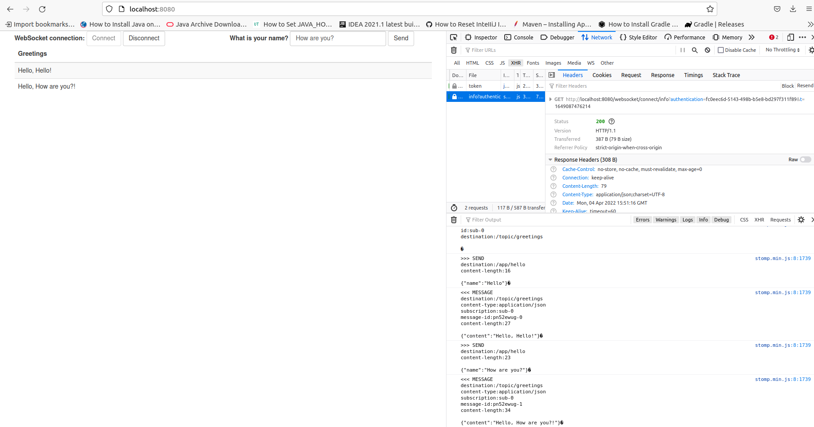

WebSocket Token-Based Authentication
====================================
В этом блоге подробно описан шаблон, которому можно следовать, чтобы преодолеть встроенные препятствия, связанные с защитой связи через WebSocket.

* `Tutorial`: https://nuvalence.io/blog/websocket-token-based-authentication
* `Repo`: https://github.com/Nuvalence/websocket-auth-demo

Аутентификация в протоколе WebSocket не так проста как в некоторых других протоколах.
При создании соединения из JavaScript настройка заголовков в запросе рукопожатия WebSocket невозможен.
Это лишает нас возможности безопасно отправлять информацию об аутентификации/авторизации в заголовках запроса.

Однако мы по-прежнему можем передавать информацию через параметр строки запроса.
Поскольку URL-адреса могут быть зарегистрированы и перехвачены даже при защите с помощью SSL, было бы неразумно передавать токены внутренней аутентификации, которые могут содержать конфиденциальную информацию.

Это может быть расширено за счет дополнительной проверки временного токена внешней аутентификации, например проверки того, что запрос на получение временного токена и запрос на установление рукопожатия WebSocket исходят от одного и того же IP-адреса.
Кроме того, мы могли бы извлечь конечную точку HTTP с сервера WebSocket, используя внешний кеш.

1. Запросы на аутентификацию отправляются в конечную точку HTTP /authenticate/token с токеном внутренней аутентификации, который безопасно передается в заголовке запроса.
   Сервер создает временный внешний токен аутентификации, сохраняет его в кэше аутентификации и возвращает клиенту.
2. Клиент делает запрос квитирования WebSocket с маркером внешней аутентификации, переданным в качестве параметра строки запроса в URL-адресе конечной точки квитирования.
   Сервер проверяет кэш, чтобы убедиться, что внешний токен проверки подлинности действителен.
   Если он действителен, устанавливается рукопожатие и происходит обновление HTTP до протокола WebSocket.

Теперь клиент прошел аутентификацию, и теперь может осуществляться двунаправленная связь.

* http://localhost:8080

